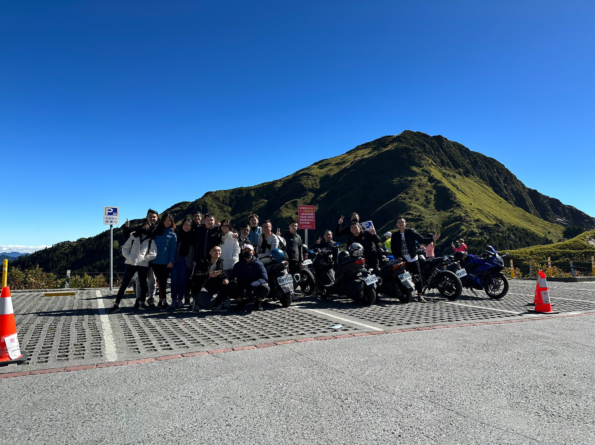
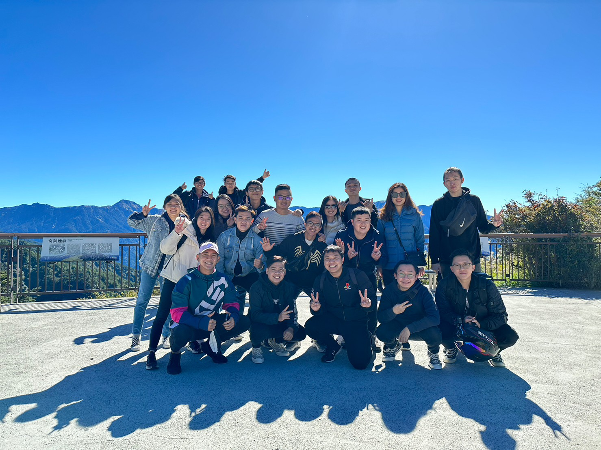
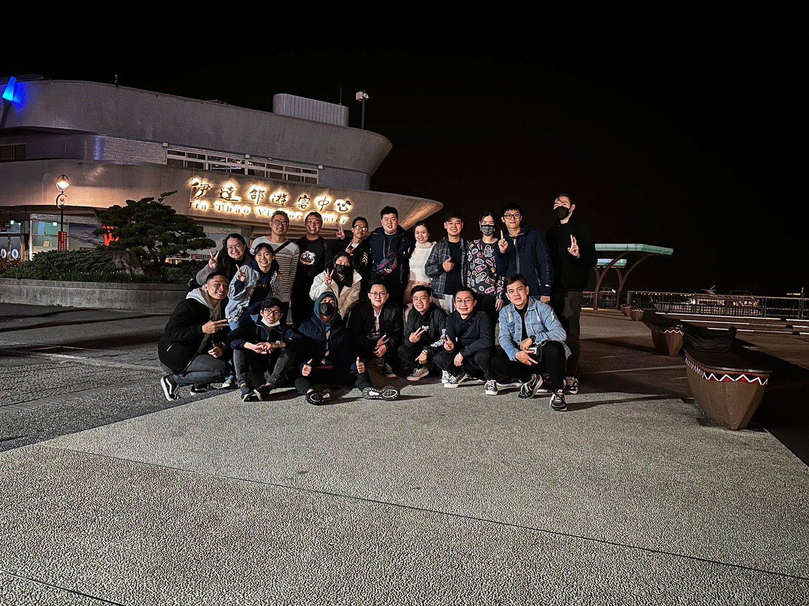

### Kennymaret
Hei! wilujeng sumping

### introduction
My name is Kenny Stefanus, and I'm a recent International Business Administration graduate from Tunghai University. Now I currently taking a master's Global Master Business Administration.

I've been working as a junior marketing at PT. ANUGRAH BINTANG TRIJAYA CONSTRUCTION, and several part time jobs such as food delivery, waiter and factory worker.

currently, my job as sales to sale computer parts (cables, hub, cable ports, etc) and if you want to rent a server, you can also contact me. 0983*** hehe 

### My advanture in Taiwan

here's my Taiwan trips with my friends.
Hehuan Mountain-> Theme Park -> Sun Moon Lake -> Mountain again hehehe

  

  

 “A good friend listens to your adventures. Your best friend makes them with you.”

yey! wilujeng kantun. 

<!--
**kennymaret/kennymaret** is a ✨ _special_ ✨ repository because its `README.md` (this file) appears on your GitHub profile.

Here are some ideas to get you started:

- 🔭 I’m currently working on ...
- 🌱 I’m currently learning ...
- 👯 I’m looking to collaborate on ...
- 🤔 I’m looking for help with ...
- 💬 Ask me about ...
- 📫 How to reach me: ...
- 😄 Pronouns: ...
- ⚡ Fun fact: ...
-->
